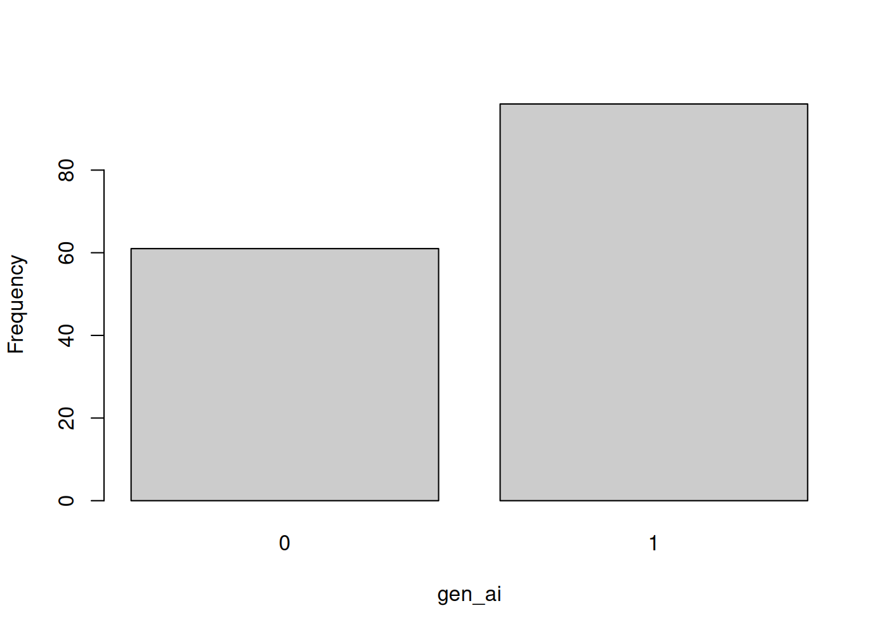
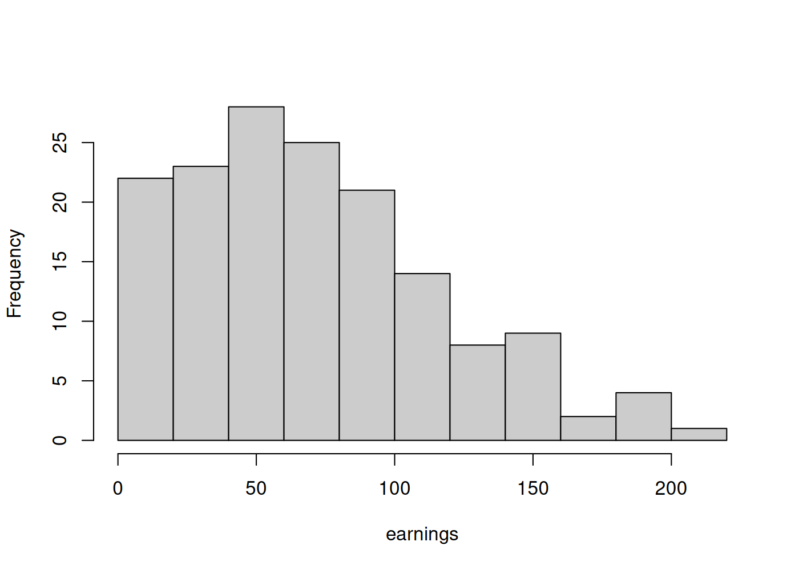

```{r setup, include=FALSE}
# Like the paper, this document reads the data from 2_process (the analysis
# data plus the untouched raw copy the engines save there), so every number
# below updates when the pipeline reruns. Run `make` first.
read_proc <- function(stem) {
  rds <- paste0("../2_process/", stem, ".rds")
  dta <- paste0("../2_process/", stem, ".dta")
  if (file.exists(rds)) return(readRDS(rds))
  if (file.exists(dta)) {
    if (!requireNamespace("haven", quietly = TRUE))
      install.packages("haven", repos = "https://cloud.r-project.org")
    return(haven::read_dta(dta))
  }
  stop("No processed data found. Run the pipeline first (e.g. `make all`).")
}

data <- read_proc("edit_gen_ai_earnings")
n_analysis <- nrow(data)
n_raw      <- nrow(read_proc("gen_ai_earnings"))
```

This data appendix documents the analysis data: the processed dataset the results are estimated on (`2_process/edit_gen_ai_earnings`). It defines every variable, states how it was derived from the raw data, and shows its distribution, so that anyone reproducing the project can verify that their rebuilt dataset matches this one before rerunning the analysis. The raw input file is documented separately in `0_data/codebook.md`. Every table and figure below is written by the analysis code to `3_output/data_appendix/` and imported here, so this document updates itself when the data or the code change.

# The analysis data file

The unit of observation is one synthetic firm-observation per row. The raw file contains `r n_raw` observations; the analysis data contain `r n_analysis`, after dropping observations with negative scaled earnings. No variable has missing values.

# Variables

## id

Observation identifier (integer), carried over unchanged from the raw data. Not used in the analysis.

## gen_ai

Indicator for generative AI use (1 = uses generative AI, 0 = does not), carried over unchanged from the raw data.

```{=tex}
\begin{center}
\input{../3_output/data_appendix/freq_gen_ai.tex}
\end{center}
```

{width=55%}

## earnings

Synthetic earnings measure in arbitrary units, carried over from the raw data; the analysis sample keeps only observations with non-negative scaled earnings.

{width=55%}

## earnings_scaled

Derived variable: `earnings / 10`. Observations with `earnings_scaled < 0` are dropped from the analysis sample. This is the dependent variable in Table 1.

{width=55%}

# Summary statistics

Reported as n(missing), mean, standard deviation, minimum, 25th percentile, median, 75th percentile, and maximum.

```{=tex}
\begin{center}
\input{../3_output/data_appendix/summary_stats.tex}
\end{center}
```
